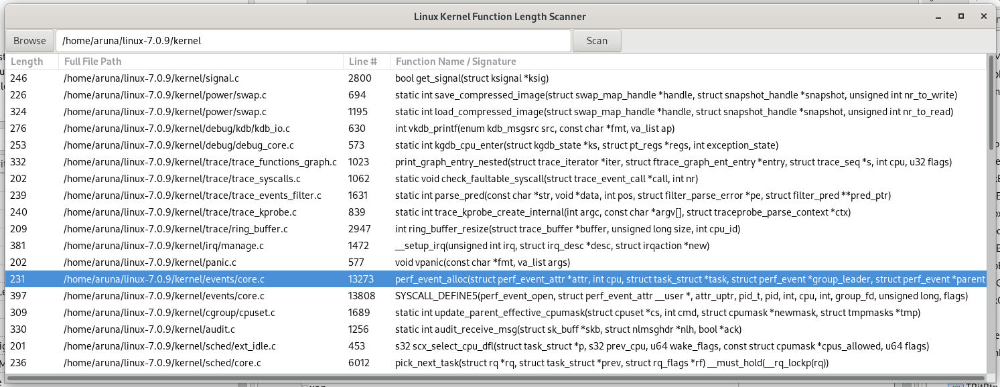

# scan linux kernel function length

scankernel (Linux Kernel Function Length Scanner)The Linux Kernel Function Length Scanner is a static analysis desktop application designed to audit and map the scale of C function implementations across the Linux kernel source tree. By scanning specified kernel directories, it extracts function signatures, maps their exact location, and calculates their line lengths
